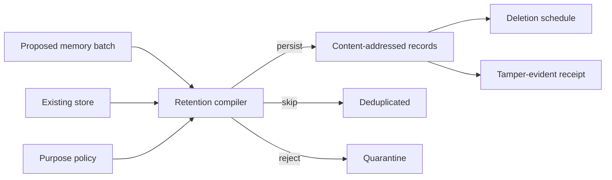

# PersistPermit

**A purpose-and-retention compiler for persistent AI agent memory.**

Long-term memory can make an AI assistant useful across sessions. It can also
turn one malicious document, accidental credential, stale fact, or unnecessary
personal detail into durable state.

PersistPermit evaluates proposed memory writes before they reach storage. Every
entry must fit an approved purpose, scope, source, sensitivity class, consent
grant, and retention window.



## Controls

- Purpose and scope allowlists
- Maximum TTL assignment and clamping
- Consent coverage and expiration
- Source-kind and source-trust boundaries
- Secret, credential, email, phone, and durable-instruction detectors
- Sensitivity under-declaration checks
- Normalized content deduplication
- Structured fact contradiction detection
- Explicit supersession with immediate deletion scheduling
- Per-entry content hashes and compilation receipts

## Quick start

Requirements: Node.js 20+ and pnpm 10.14+.

```bash
pnpm install
pnpm check

pnpm permit compile examples/safe-batch.json \
  --store examples/store.json \
  --policy examples/policy.json \
  --at 2026-07-29T09:00:00.000Z

pnpm permit compile examples/adversarial-batch.json \
  --store examples/store.json \
  --policy examples/policy.json \
  --at 2026-07-29T09:00:00.000Z
```

The safe batch is compiled into a record and deletion deadline. The adversarial
batch is blocked.

## CLI

```text
persist-permit scan <text-file> [--json]
persist-permit compile <batch.json> --store <store.json> --policy <policy.json>
persist-permit explain <batch.json> --store <store.json> --policy <policy.json> --proposal <id>
persist-permit schedule <batch.json> --store <store.json> --policy <policy.json>
persist-permit receipt <batch.json> --store <store.json> --policy <policy.json> --output <receipt.json>
persist-permit verify <receipt.json> [--batch <json>] [--store <json>] [--policy <json>]
persist-permit demo [safe|adversarial]
persist-permit init [directory]
```

Exit codes: `0` clean or valid, `2` blocked, `3` review required, and `5`
invalid input.

## Compile model

Each proposed memory includes its content, purpose, scope, subjects,
sensitivity, source provenance, structured facts, creation time, optional
expiry, consent, and superseded record IDs.

The compiler:

1. verifies purpose, scope, source, sensitivity, and consent;
2. scans content for deterministic privacy and poisoning signals;
3. assigns or clamps the retention deadline;
4. checks normalized duplicates and structured fact conflicts;
5. emits persist, skip, or reject decisions;
6. produces the exact deletion schedule.

See [BATCH.md](docs/BATCH.md) and [POLICY.md](docs/POLICY.md).

## Contradictions and supersession

Natural-language contradiction detection is intentionally out of scope. Supply
stable facts such as:

```json
{ "key": "timezone", "value": "Asia/Tokyo" }
```

If the store already contains another value for `profile:timezone`, the new
write is blocked unless `supersedesIds` names the old memory. An accepted
supersession schedules the old entry for immediate deletion.

## Studio

```bash
pnpm dev
```

The interactive Studio shows a memory inbox, persist/skip/reject dispositions,
privacy score, content hashes, findings, and deletion deadlines. Safe and
poisoned demo batches run entirely in the browser.

## Research context

Persistent memory creates an attack surface that can survive across future
conversations. The project is informed by:

- [From Untrusted Input to Trusted Memory](https://arxiv.org/abs/2606.04329)
- [Hidden in Memory: Sleeper Memory Poisoning](https://arxiv.org/abs/2605.15338)
- [When Agents Remember Too Much](https://arxiv.org/abs/2607.06595)
- [NIST AI Minimization Toolkit](https://www.nist.gov/privacy-framework/resource-repository/browse/guidelines-and-tools/ai-minimization-toolkit)

## Security boundary

Pattern detectors cannot recognize every secret, identifier, or adversarial
instruction. Structured facts and source trust are declarations. PersistPermit
does not replace consent management, encryption, access control, sandboxing,
human review, or retrieval-time defenses. Read
[THREAT-MODEL.md](docs/THREAT-MODEL.md).

## Repository layout

```text
packages/core    policy compiler, detectors, contradictions, receipts
packages/cli     automation and deletion schedule output
apps/studio      interactive memory-write review
examples         safe and adversarial fixtures
docs             batch, policy, integration, and threat model
```

## License

[MIT](LICENSE)
